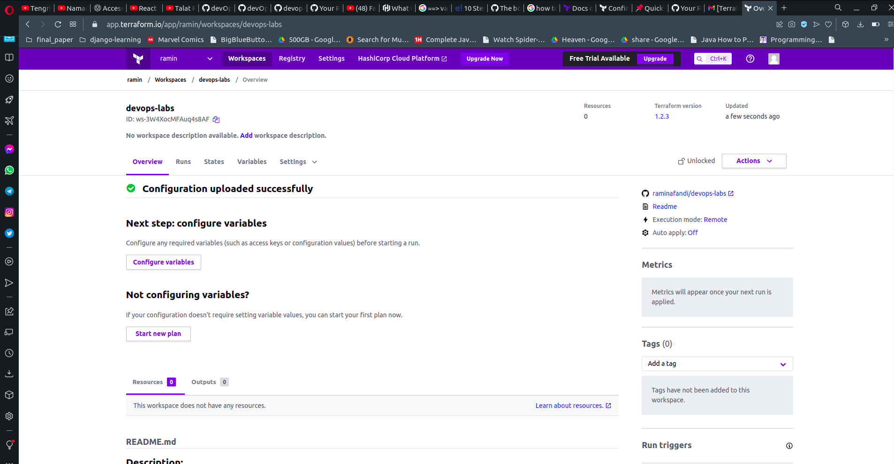

# Terraform Best Practices:

1. Run terraform command with var-file
2. Enable version control on terraform state files bucket
3. Turn on debug when you need do troubleshooting
4. Use shared modules
5. Isolate environment
6. Use terraform import to include as many resources you can
7. Avoid hard coding the resources
8. Validate and format terraform code
9. Update terraform version

# Vagrant and 3 vms

# Terraform

## Terraform initialized

## Terraform made a github repo

## Registered in Hashicorp cloud

