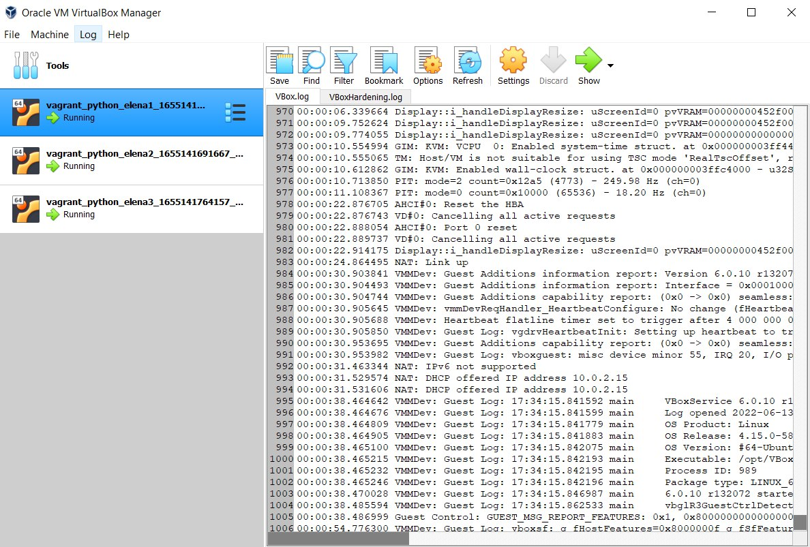

#Best practices for Terraform

Based on the official [Google Cloud](https://cloud.google.com/docs/terraform/best-practices-for-terraform). 

1. Follow a standard module structure.
2. Adopt a naming convention.
3. Use variables carefully.
4. Expose outputs.
5. Use data sources.
6. Limit the use of custom scripts.
7. Include helper scripts in a separate directory.
8. Put static files in a separate directory.
9. Protect stateful resources.
10. Use built-in formatting.
11. Limit the complexity of expressions.
12. Use count for conditional values.
13. Use for_each for iterated resources.
14. Publish modules to a registry.

